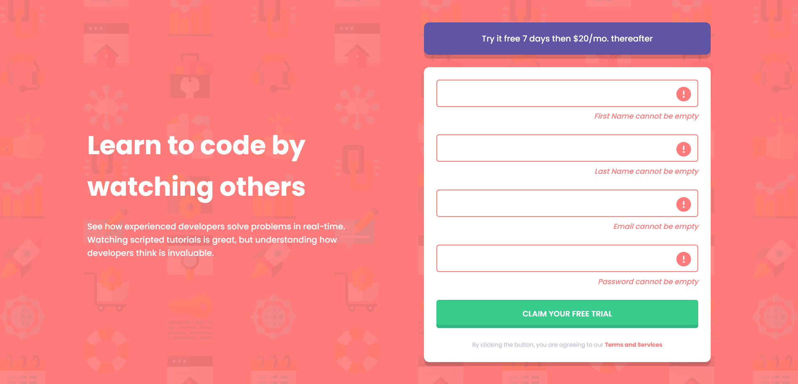

# Frontend Mentor - Intro component with sign up form

## 🗺️ Table of contents

- [Frontend Mentor - Intro component with sign up form](#frontend-mentor---intro-component-with-sign-up-form)
  - [🗺️ Table of contents](#️-table-of-contents)
  - [🐦 Overview](#-overview)
    - [💪 The challenge](#-the-challenge)
    - [🖼️ Screenshot](#️-screenshot)
    - [🔗 Links](#-links)
  - [🚀 My process](#-my-process)
    - [🏗️ Built with](#️-built-with)
    - [🧠 What I learned](#-what-i-learned)
    - [🎯 Continued development](#-continued-development)
    - [🛠️ Useful resources](#️-useful-resources)
  - [🙍‍♀️ Author](#️-author)

## 🐦 Overview

### 💪 The challenge

Users should be able to:

- View the optimal layout for the site depending on their device's screen size
- See hover states for all interactive elements on the page
- Receive an error message when the `form` is submitted if:
  - Any `input` field is empty. The message for this error should say _"[Field Name] cannot be empty"_
  - The email address is not formatted correctly (i.e. a correct email address should have this structure: `name@host.tld`). The message for this error should say _"Looks like this is not an email"_

### 🖼️ Screenshot



### 🔗 Links

- Challenge URL: [Frontend Mentor](https://www.frontendmentor.io/challenges/intro-component-with-signup-form-5cf91bd49edda32581d28fd1)
- Solution URL: [https://github.com/NoaSalgado/Sign-Up-Form-Intro-Component](https://github.com/NoaSalgado/Sign-Up-Form-Intro-Component)
- Live Site URL: [https://noasalgado.github.io/Sign-Up-Form-Intro-Component/](https://noasalgado.github.io/Sign-Up-Form-Intro-Component/)

## 🚀 My process

### 🏗️ Built with

- Semantic HTML5 markup
- CSS custom properties
- Flexbox
- CSS Grid
- Mobile-first workflow

### 🧠 What I learned

With this challenge I learned and practiced about some basic form validations on the client side.

I also learned how to hide labels, by design requirement in an accesible way:

```html
<label for="password" class="visually-hidden">Password</label>
```

```css
.visually-hidden {
  border-width: 0 !important;
  clip: rect(1px, 1px, 1px, 1px) !important;
  height: 1px !important;
  overflow: hidden !important;
  padding: 0 !important;
  position: absolute !important;
  white-space: nowrap !important;
  width: 1px !important;
}
```

### 🎯 Continued development

In future projects I would like to focus on learn and improving accessibility and especially accessibility in forms.

### 🛠️ Useful resources

- [HTML Inputs and Labels: A Love Story](https://css-tricks.com/html-inputs-and-labels-a-love-story/) - This article helped me understand the importance of label elements for accessibility and how to hide them visually, but still be available to screen readers.
-

## 🙍‍♀️ Author

- Frontend Mentor - [@NoaSalgado](https://www.frontendmentor.io/profile/NoaSalgado)
- Twitter - [@noasalgadodev](https://twitter.com/noasalgadodev)
